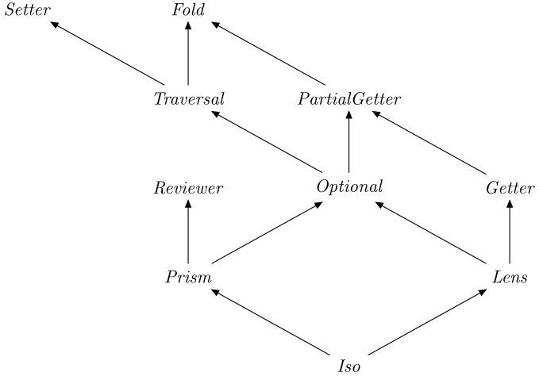

# optics.js

[](https://www.npmjs.com/package/optics.js)
[](https://bundlephobia.com/result?p=optics.js)
[](https://github.com/kutyel/optics.js/actions?query=workflow%3A%22Node.js+CI%22)
[](https://coveralls.io/github/kutyel/optics.js)
[](https://david-dm.org/kutyel/optics.js)
[](https://www.npmjs.org/package/optics.js)

> Lenses, Prisms and Traversals in JavaScript!

<p align="center">
  <br>
  
  <br>
</p>

Inspired by Haskell's [`optics`](https://hackage.haskell.org/package/optics) package

- [Get it!](#get-it)
- [How it is made!](#how-it-is-made)
- [Meet it!](#meet-it)
- [Use it!](#use-it)
  - [Amount of values](#amount-of-values)
  - [Builders](#builders)
  - [The whole hierarchy](#the-whole-hierarchy)
- [Know them all!](#know-them-all)

## Get it!

```bash
$ npm install optics.js --save
```

## How it is made!

If you want to know more about the implementation, you can check this talk by [myself](https://twitter.com/FlavioCorpa) at [Lambda World](https://cadiz.lambda.world/).

[](https://www.youtube.com/watch?v=IoVaArsh6tM)

## Meet it!

```js
import { where, maybe, optic, values } from 'optics.js'

const people = [
  {
    name: { first: 'Alejandro', last: 'Serrano' },
    birthmonth: 'april',
    age: 32,
  },
  {
    name: { first: 'Flavio', last: 'Corpa' },
    birthmonth: 'april',
    age: 29,
  },
  { name: { first: 'Laura' }, birthmonth: 'august', age: 27 },
]

const firstNameTraversal = optic(values, 'name', 'first').toArray(people)
const lastNameOptional = optic(values, 'name', maybe('last')).toArray(people)
const o = optic(values, where({ birthmonth: 'april' }), 'age')
const ageTraversal = o.toArray(people)
const agePlus1Traversal = o.over(x => x + 1, people)
```

Optics provide a _language_ for data _access_ and _manipulation_ in a concise and compositional way. It excels when you want to code in an _immutable_ way.

[](https://www.youtube.com/watch?v=pZ-ELcxYwVc)

There are very few moving parts in `optics.js`, the power comes from the ability to create long combinations or _paths_ by composing small primitive optics. Let's look at an example:

```js
import { optic, maybe, view, over } from 'optics.js'

const wholeMilk = optic('milk', maybe('whole'))
```

In most cases, the `optic` function will be your starting point. It takes any amount of arguments describing primitive optics, and fuses them together. In this case, we are creating an optic which accesses the `milk` key, and then accesses the `whole` key if available (notice that the name is wrapped with `maybe`).

Intuitively, optics simply point to one (or more) positions within your data. You can then _operate_ at that position in a particular piece of data. In the following example we obtain the value within the shopping list, and then increment it.

```js
const shoppingList = { pie: 3, milk: { whole: 6, skimmed: 3 } }

view(wholeMilk, shoppingList) // > 6
over(wholeMilk, x => x + 1, shoppingList)
// > { pie: 3, milk: { whole: 7, skimmed: 3 } }
```

As mentioned above, the result of `over` is a _fresh_ object, so immutability is guaranteed.

## Use it!

As discussed while meeting the library, `optics.js` is based around a few primitive optics, which are composed using the `optic` function. Different _kinds_ of optics support different _operations_; that is one of the key ideas. You can apply those operations in two ways, depending on your preferred coding style:

```js
operation(optic, ...other args, value)
optic.operation(...other args, value)
```

In any case, the optic always goes first, and the value to which the operation should be applied goes last.

### Amount of values

An optic can target zero, one, or an unrestricted amount of positions within your data. This allows us, for example, to provide an optic which targets every value within an array (unrestricted amount) or targets an optional value (zero or one). The operations are called differently depending on this fact:

- `view` targets exactly _one_ value, like a property in an object which we are guaranteed to have.
- `preview` targets _zero_ or _one_ values, which essentially amounts to an optional value, like an index in an array which may go out of bounds.
- `reduce` and `toArray` target an _unrestricted_ amount, like the aforementioned array or the values within an object.

It is always safe to treat an optic in a less restricted way. For example, if your optic targets exactly one value, you can also use `preview` or `toArray` over it.

In any of the three cases you may be able to _modify_ the values targeted by the optic. You can do so in two ways:

- `set` takes a single value, and _replaces_ every position pointed by the data with it.
- `over` takes a function which is applied at each position targeted by the optic.

Since we have three "levels of amounts" and two possibilities about setting (we are able or not), we get _six_ different kinds of optics, plus an additional one for setting without access. Those receive different names, as shown in the following table (names in parentheses are those used by other similar libraries.)

| **`set`?** | **Exactly 1** | **0 or 1**                      | **Unrestricted** | **No access**  |
| ---------- | ------------- | ------------------------------- | ---------------- | -------------- |
| **Yes**    | `Lens`        | `Optional` (`AffineTraversal`)  | `Traversal`      | `Setter`       |
|  **No**    | `Getter`      | `PartialGetter` (`AffineFold`)  | `Fold`           | does not exist |

### Builders

The previous six kinds of optics can only access or modify values. There is one additional capability an optic may have: being able to _create_ values. Take for example the `Optional` which accesses an object with a single key `k`. If we give this optic a value, it can create a new object with that single key:

```js
import { review, single } from 'optics.js'

review(single('say'), 'hi!') // > { say: 'hi!' }
```

This adds yet another axis to our previous table, depending on whether when accessing you are guaranteed to have a value or not.

| **Exactly 1** | **0 or 1** | **Unrestricted** | **No access** |
| ------------- | ---------- | ---------------- | ------------- |
| `Iso`         | `Prism`    | does not exist   | `Reviewer`    |

### The whole hierarchy

The different kinds of optics can be arranged into a hierarchy. Going up means weakening the restrictions, either by set of operations or by amount of elements.

> The image has been produced from the diagram in the [`optics`](https://hackage.haskell.org/package/optics) package.

## Know them all!

`optics.js` ships with a bunch of predefined optics. Bear in mind that the `alter` and `ix` lenses are the default when you use combinators, so:

```js
optic(maybe('friends'), 0, 'name')
```

is equivalent to (the longer):

```js
optic(maybe('friends'), ix(0), alter('name'))
```

### _The_ `notFound` value

Whenever an optic needs to indicate that there is no value to return, the special value `notFound` is used. This value is _different_ from `null`, `undefined`, and any other except itself. To check whether an optic returns no values, you can use one of the following versions:

```js
if (isNotFound(preview(maybe('age'), person))) ...
if (maybe('age').preview(person) === notFound) ...
```

Note that `notFound` is _not_ [falsy](https://developer.mozilla.org/en-US/docs/Glossary/Falsy), so the following JavaScript idioms are _not_ available:

```js
if (!preview(maybe('age'), person)) ...
maybe('age').preview(person) || defaultAge
```

### Combinators

#### `optic : [Optic a b, Optic b c, ..., Optic y z] -> Optic a z`

Creates a combined optic by applying each one on the result of the previous one. This is the most common way to combine optics.

#### `collect : { k: Getter s a | PartialGetter s a | Fold s a } -> Getter s { k: v }`

Generates a new object whose keys are based on the given optics. Depending on the type of optic, a single value, optional value, or array is collected.

```js
collect({ edad: optic('age') }).view({ name: 'Alex', age: 32 }) // { edad: 32 }
```

#### `transform : (s -> a) -> Getter s a`

Applies a transformation to the values targetted up to then. Since the transformation may not be reversible, after composing with `transform` you lose the ability to set or modify the value.

```js
transform(x => x + 1).view(2) // 3
```

This can be very useful in combination with `collect`.

```js
optic(
  collect({ first: optic('firstName'), last: optic('lastName')}),
  transform(x => x.first + ' ' + x.last)
).view({ first: 'Alex', last: 'Smith' }) // 'Alex Smith'
```

#### `sequence : [Fold s a] -> Fold s a`

Joins the result of several optics into a single one. In other words, targets all values from each of the given optics.

```js
sequence('age', 'name').toArray({ name: 'Alex', age: 32 }) // [ 32, 'Alex' ]
```

#### `firstOf : [Optic s a] -> Optic s a`

Tries each of the optics until one matches, that is, returns something different from `notFound` (when talking about optionals or partial getters) and `[]` (when talking about traversals and folds).

```js
view(firstOf('firstName', 'name'), { name: 'Alex', age: 32 }) // 'Alex'
```

In combination with `always` it can be used to provide a default value when an optic targets no elements.

```js
view(firstOf('name', always('Pepe')), { name: 'Alex', age: 32 }) // 'Alex'
view(firstOf('name', always('Pepe')), { }}) // 'Pepe'
```

### Lenses (view, set)

#### `alter : k -> Lens (Object | notFound) (a | notFound)`

Given a `key`, its `view` operation returns:

- the value at that key if present in the object,
- the special value `notFound` if not.

The `set`/`over` operation can be used to modify, create, and remove keys in an object.

```js
set(optic('name'), 'Alex', { name: 'Flavio' }) // { name: 'Alex' }
set(optic('name'), 'Alex', {}) // { name: 'Alex' }
set(optic('name'), notFound, { name: 'Flavio' }) // { }
```

#### `mustBePresent : k -> Lens { k: a, ... } a`

Given a key, both `view` and `set`/`over` operate on that key in an object. However, the key _must_ already be present, otherwise `undefined` is returned.

#### `ix : number -> Lens Array a`

Given an index, both `view` and `set`/`over` operate on that index in an array. This lens cannot be used to grow or shrink the array, you can only access or modify positions which are already available.

### Optionals (preview, set)

#### `maybe : (string | number) -> Optional (Object | Array) a`

In a similar fashion to `alter`, the `view` operation returns:

- the value at the key, or at the given index, if present in the object or array,
- the special value `notFound` if not.

However, `maybe` does _not_ create or remove keys from an object. The most common use is to modify only values which are already there.

```js
over(maybe('age'), x => x + 1, { name: 'Alex', age: 32 })
// { name: 'Alex', age: 33 }
over(maybe('age'), x => x + 1, { name: 'Flavio' })
// { name: 'Flavio' }
```

#### `never : Optional s a`

This optional _never_ matches: `view`ing through it always returns `notFound`, using it to set makes no changes to the given value. It can be useful when combined in `sequence`, as it adds no additional values.

### Prisms (preview, set, review)

#### `where : { ...obj } -> Prism { ...obj, ...rest } { ...obj }`

This prism targets only objects which contain a given "subobject". This might be seen more clearly with a few examples:

```js
preview(optic(where({ id: 1 }), 'name'), { id: 1, name: 'Alex' }) // 'Alex'
preview(optic(where({ id: 1 }), 'name'), { id: 2, name: 'Alex' }) // notFound
```

This prism is quite useful when dealing with [discriminating unions](https://www.typescriptlang.org/docs/handbook/unions-and-intersections.html#discriminating-unions), like those usually found in [Redux actions](https://redux.js.org/basics/actions):

```js
optic(where({ type: 'ADD_ITEM' }), ...)
```

Since it is a prism, `where` may also be used for constructing objects. In that case, it ensures that the subobject is part of the created:

```js
where({ type: 'ADD_ITEM' }).review({ item: 'Hello' })
// { type: 'ADD_ITEM', item: 'Hello' }
```

When combined with traversals like `values`, `where` can be used to filter out values.

```js
// return only people who were born in April
toArray(optic(values, where({ birthmonth: 'april' })), people)
```

Note that when matching the optic itself returns the _whole_ object again:

```js
preview(where({ id: 1 })), { id: 1, name: 'Alex' })  // { id: 1, name: 'Alex' }
```

### Traversals (toArray, set)

#### `values : Traversal Array a`

Targets every position in an array.

```js
over(values, x => x + 1, [1, 2, 3]) // [2, 3, 4]
```

#### `entries : Traversal Object [k, v]`

Targets every key-value pair in an object. As with the identically-named `entries` method in `Object`, those pairs are returned as two-element arrays:

```js
toArray(entries, { name: 'Alex', age: 32 })
// [ ['name', 'Alex'], ['age', 32] ]
```

When using `set`/`over` with `entries`, you _must_ always return the _same key_ that was given to you, or `BadThingWillHappen`.

```js
over(entries, ([k, v]) => [k, v + 1], numbers) // right
over(entries, ([k, v]) => v + 1, numbers) // throws TypeError
```

### Getters (view)

#### `always : a -> Getter s a`

Always return the given value. As described above, it can be used in combination with `firstOf` to provide a default value for a possibly-missing field.

```js
view(always('zoo'), 3) // 'zoo'
```

### Isos (view, set, review)

#### `single : k -> Iso { k: a } a`

This optic matches may only focus on values with a _single_ key. Note that this is _not_ an `Optional` or `Prism`, so trying to use it on a value with a different shape raises an error instead of returning `notFound`.

Since `Iso`s give you the `review`, you can use `single` to build objects too:

```js
review(single('name'), 'Flavio') // { name: 'Flavio' }
```

## License

**optics.js** © [Flavio Corpa](https://twitter.com/FlavioCorpa), released under the [MIT](https://github.com/kutyel/optics.js/blob/master/LICENSE.md) License.<br>

Authored and maintained by [Flavio Corpa](https://twitter.com/FlavioCorpa) and [Alejandro Serrano](https://twitter.com/trupill) with help from [contributors](https://github.com/kutyel/optics.js/contributors).

> GitHub [Flavio Corpa](https://github.com/kutyel) · Twitter [@FlavioCorpa](https://twitter.com/FlavioCorpa) · GitHub [Alejandro Serrano](https://github.com/serras) · Twitter [@trupill](https://twitter.com/trupill)
